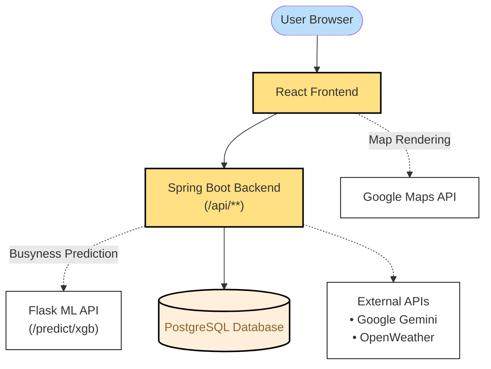

# 🗽 SmartTrip NYC — Intelligent Itinerary Planner

**SmartTrip NYC** is a full-stack AI-powered travel planning platform for New York City. It combines real-time traffic, weather, transit, and social trend data to help users make informed travel decisions and generate personalized itineraries.

🌐 **Live Demo**: [https://smarttrip.duckdns.org](https://smarttrip.duckdns.org)

---

## Table of Contents

- [✨ Features](#-features)
- [📦 Tech Stack](#-tech-stack)
- [🧠 System Architecture](#-system-architecture)
- [🚀 Deployment Overview](#-deployment-overview)
- [🗂️ Branch Strategy](#️-branch-strategy)
- [🧪 Local Development Setup](#-local-development-setup)
- [⚙️ Configuration](#️-configuration)
- [🤝 Contributing](#-contributing)
- [📬 Contact](#-contact)
- [👥 Contributors](#-contributors)

---

## ✨ Features

- **AI Trip Generator**: Gemini-powered itineraries from user prompts
- **Custom Trip Planner**: Manual drag-and-drop itinerary builder
- **TikTok Travel Trends**: Explore trending places and content from TikTok to inspire smarter trip planning
- **Busyness Forecast**: 24-hour predicted zone congestion using XGBoost
- **Interactive Map**: Real-time + forecasted zone visualization
- **Secure Auth**: Traditional login + Google OAuth (via Spring Security)
- **Responsive Design**: Mobile-friendly, fast and touch-friendly

---

## 📦 Tech Stack

**Frontend:**

- React + TypeScript
- Tailwind CSS
- Vite + Axios for fast builds and efficient API communication
- Google Maps JavaScript API for map rendering and routing

**Backend:**

- Spring Boot (Java) for core API logic
- Spring Security for user authentication and authorization (supports Google OAuth2)
- Google Gemini API (AI itinerary generation)
- RESTful APIs for user login, trip planning, AI suggestions, and zone busyness retrieval

**Data & Machine Learning:**

- Flask ML API (Python)
- XGBoost model for zone busyness prediction
- Data sources: NYC Taxis, Subway, POIs, Google Trends, OpenWeather
- Python stack: pandas, scikit-learn, numpy, pytrends

**Database:**

- PostgreSQL
- Structured tables for zones, POIs, trip history, user data etc

**Deployment:**

- GitHub Actions CI/CD (auto-deploy on push to `master`)
- Docker & Docker Compose
- NGINX reverse proxy + TLS
- Deployed on a remote Linux-based cloud server

---

## 🧠 System Architecture



---

## 🚀 Deployment Overview

This `master` branch is automatically deployed to production:

- CI/CD via GitHub Actions
- Dockerized services (Spring Boot, Flask ML, PostgreSQL)
- Secrets (API keys, DB config) injected from GitHub Secrets
- NGINX handles reverse proxy + TLS termination
- Remote Linux cloud server

🌐 Live Server: https://smarttrip.duckdns.org

## 🗂️ Branch Strategy

| Branch     | Description                                 |
| ---------- | ------------------------------------------- |
| `master`   | Production branch (auto-deployed via CI/CD) |
| `dev`      | Main development branch                     |
| `feature/` | Feature branches (merged into `dev`)        |
| `fix/`     | Bugfix branches                             |
| `style/`   | UI/styling enhancements                     |

> ⚠️ **Important:** Please avoid direct commits to `master`.  
> All development should occur in `dev` or dedicated feature branches and be merged via Pull Request.

---

## 🧪 Local Development Setup

If you're contributing or testing locally, follow these steps.

**1. Clone the Repository**:

```bash
git clone https://github.com/imyuanhui/COMP47360.git
cd COMP47360
git checkout dev
```

**2. Start All Services (via Docker)**:

```bash
cd COMP47360
docker-compose -f docker/docker-compose.dev.yml up -d --build
```

This will start:

- pring Boot backend (Java)
- Flask ML API (Python)
- PostgreSQL database
- All necessary networking and volume configs

**3. Frontend Development**:

```bash
cd frontend/apps/web
npm install
npm run dev
```

The app will be available at http://localhost:5173.

---

## ⚙️ Configuration

Configure your secrets and runtime configs using .env or GitHub Secrets (CI/CD):

```env
# PostgreSQL
POSTGRES_USER=postgres
POSTGRES_PASSWORD=your_password
POSTGRES_DB=smart-trip

# Spring Boot backend
SPRING_DATASOURCE_URL=jdbc:postgresql://postgres:5432/smart-trip
SPRING_DATASOURCE_USERNAME=postgres
SPRING_DATASOURCE_PASSWORD=your_password
ML_SERVICE_URL=http://flask-ml:5000

# Secrets
JWT_SECRET=your jwt_secret
WEATHER_API_KEY=your_openweather_key
GEMINI_API_KEY=your_google_gemini_key

# Google OAuth2
GOOGLE_CLIENT_ID=your_google_client_id
GOOGLE_CLIENT_SECRET=your_google_client_secret
```

---

## 🤝 Contributing

We welcome contributions! 🎉

```bash
git checkout -b feature/your-feature-name
# make your changes
git commit -m "feat: Add your awesome feature"
git push origin feature/your-feature-name
```

Then open a pull request against `dev` ! 🚀

---

## 📬 Contact

For bug reports, feedback, or contributions:

- **Email**:yuanhui.xu@ucdconnect.ie
- **GitHub Issues**: [Open an Issue](https://github.com/imyuanhui/COMP47360/issues) 🐛

---

## 👥 Contributors

Made with ❤️ by our team (listed below in no particular order):

- [Yuanhui Xu](https://github.com/imyuanhui)
- [Simon Maybury](https://github.com/Simon-mt1)
- [Shuangning Wei](https://github.com/Shelly892)
- [Chiayu Lin](https://github.com/chiayu2999)
- [Charan Chowdary Singu](https://github.com/charansingu)

Thank you for exploring SmartTrip NYC!
We hope it makes your journey smoother, smarter, and more spontaneous ✨🗽🧳
